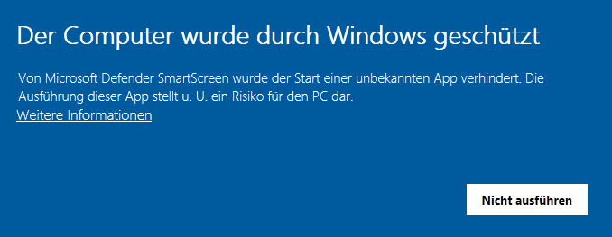
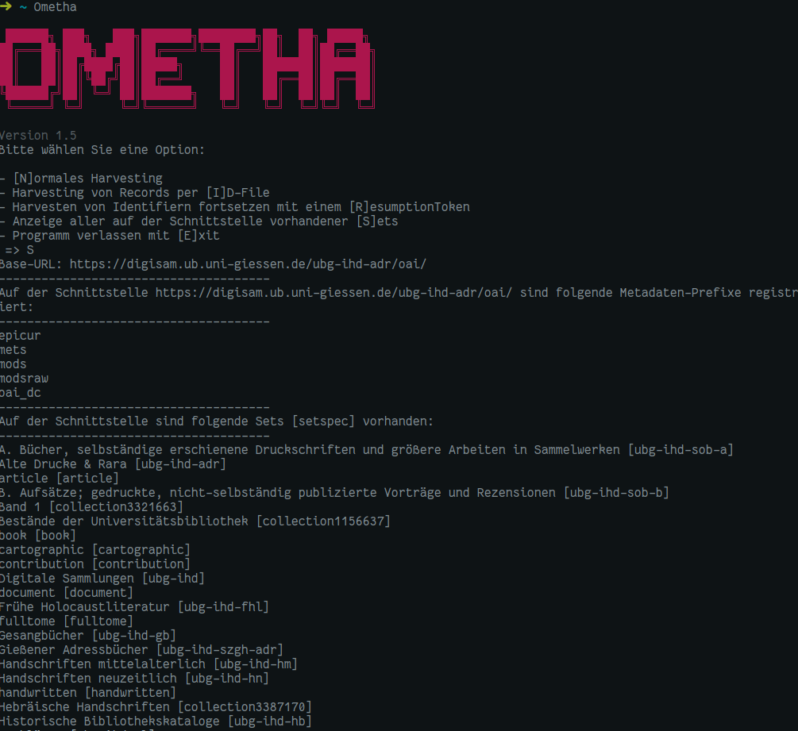

# Ometha (*OaiMETadataHArvester*)

# Features

Die zentrale Anforderung für Workflow der Fachstelle Bibliothek ist, dass jeder OAI-Record in einer eigene Datei ist, mit eigenem OAI-Header. Das lässt sich theoretisch auch mit „normalem“ Harvesting erreichen (in dem man die XML Dateien nach dem Harvestingvorgang splittet), wir haben uns aber auch aus Gründen der Stabilität der Schnittstellen dafür entschieden, über das Verb `ListIdentifiers` zunächst alle relevanten OAI-IDs zu harvesten und dann per `GetRecord` die einzelnen Datensätze einen nach dem anderen anzuziehen.

Die zweite Anforderung an den Harvester ist der Spagat zwischen der Möglichkeit der Automatisierung und Benutzerfreundlichkeit. Daher umfasst Ometha drei Modi:

- einen „interaktiven“ Modus, der den Benutzer nach den Variablen fragt - nutzbar als Ometha.exe per Doppelklick unter Windows; keine Installation nötig
- Kommandozeilenmodus mit Parameter-Übergabe
- Kommandozeilenmodus per Konfigurationsdatei(en) inkl. vollautomatischem Update-Modus

## Geschwindigkeit

Harvesting eines Sets mit 19999 Datensätzen von der OAI Schnittstelle der Deutschen Digitalen Bibliothek:

1. Ometha
   - `Ometha default -b https://oai.deutsche-digitale-bibliothek.de/ -s 10443700598299947xcYN -m ddb`
   - 6:19 Minuten -> Log, ID List & jeder Record in einer XML Datei
2. [Metha](https://github.com/miku/metha):
   - `metha-sync https://oai.deutsche-digitale-bibliothek.de/ -set 10443700598299947xcYN -format ddb`
   - 6:33 Minuten -> gzipped XMLs mit jeweils 300 Records pro File (Abruf über ListRecords)
3. [oai-pmh](https://github.com/paperhive/oai-pmh):
   - `oai-pmh list-records -s 10443700598299947xcYN -p ddb https://oai.deutsche-digitale-bibliothek.de/ > ddbfiles.txt`
   - 13:17 Minuten -> JSON statt XML Return
4. [shell-oaiharvester](https://github.com/wimmuskee/shell-oaiharvester):
   - `./oaiharvester -r ddb`
   - 2:19:50 Stunden -> Plaintext Dateien ohne Dateiendung

# Installation

- Entweder vorkompilierte Ausführbare Datei herunterladen: https://github.com/Deutsche-Digitale-Bibliothek/ddblabs-ometha/releases - erfordert keine weiteren Installationen
- oder Download des Git-Repositorys (bzw. [eines Releases](https://github.com/Deutsche-Digitale-Bibliothek/ddblabs-ometha/releases)) und Installation von Python (mind. Version 3.8), dann in der Kommandozeile im Verzeichnis des Repos: `pip install -r requirements.txt`
  - dann start bspw. über
    ```python
    import ometha
    ometha.main()
    ```
    oder Nutzung der einzelnen Module separat.
- oder `pip install ometha` bzw. `pip install .` -> damit ist Ometha systemweit aufrufbar (bzw. bei Verwendung eines Virtual Environments nach Aktivierung des selben.)

## Windows: SmartScreen

Sollte Windows SmartScreen unter Windows 10 die Ausführung von `Ometha.exe` verhindern:



... klickt man auf den etwas unscheinbaren Link "Weitere Informationen" und dann erscheint ein kurzer Text und links neben dem Button "Nicht ausführen" der Button "Trotzdem ausführen". Letzterer startet das Programm.

# Interaktiver Modus

Der Benutzer wird zur Eingabe der erforderlichen und optionalen Parameter gebeten, die Eingaben werden validiert, mehrere Sets werden kommagetrennt eingegeben: `Seteins,Setzwei`.

Die Sonderfunktion "Anzeige aller auf der Schnittstelle vorgandener Sets" parst ListSets und ListIdentifiers rekursiv, um eine Übersicht aller vorhandenen Sets und Metadata-Prefixe zu generieren:



# Aufruf über die Kommandozeile (CLI Modus)

**Information:** Es können sowohl die ausführbare Datei als auch das Python-Script ausgeführt werden, zunächst muss aber in der Kommandozeile per `cd` Befehl in den Ordner gewechselt werden, in dem die Datei liegt (es sei denn, die Ausführbare Datei ist im PATH, also unter Linux bspw. in `/usr/bin`). Dann beginnt der Aufruf entweder mit `Ometha.exe` (Windows) oder mit `python Ometha.py` (Python Aufruf) bzw. mit `Ometha` (Unix). In den folgenden Beispielen muss also der Beginn ggf. ausgetauscht werden.

Der Aufruf von Ometha kennt vier _"positional arguments"_, die die  Modi unterscheiden: `default`, `conf`, `auto` und `ids`. Je nach Modus werden dann weitere Argumente benötigt bzw. sind möglich.

## *default* Harvesting

- **Der "normale" (=default) Kommandozeilenmodus erwartet `default` als erstes Argument**
- Die Angabe der URL der Schnittstelle per `-b` ist dabei immer zwingend notwendig
- Ebenso die Angabe des Metadata-prefixes per `-m`.
- Alle anderen Parameter sind optional


Ein Kommandozeilenaufruf sieht dann bspw. so aus:

```
ometha default -b https://oai.schnittstelle.de -m metadataprefix -d ordnername -s set1 set2 -o /home/harvesting/
```

Optionale Parameter:

- `-s/--set`: Angabe von Set(s): Mehrere Sets werden getrennt durch ein Leerzeichen eingegeben: `-s Seteins Setzwei`
- `-t/--timeout`: Timeout zwischen den GetRecord Anfragen in Sekunden (nur für wirklich instabile Schnittstellen)
- `-o/--outputfolder`: Angabe des Ordners, in dem der beim Harvesting angelegte Datenpartner-Ordner erzeugt wird
- `-d/--datengeber`: Name des Datenpartner-Ordners
- `-f/--fromdate`: From-Date: ISO8601 Zeitangabe (YYYY-MM-DD), Harvesting von OAI Records ab diesem Zeitpunkt
- `-u/--untildate`: Until-Date: ISO8601 Zeitangabe (YYYY-MM-DD), Harvesting von OAI Records bis zu diesem Zeitpunkt
- `--resumptiontoken`: ResumptionToken, falls das Identifier Harvesting abgebrochen war und wieder aufgenommen werden soll ([keine Kurzform!](#errorhandling-abbruch-beim-harvesten-der-oai-identifier))
- `-p/--parallel`: Angabe der parallelen Downloads via `GetRecord` - default ist 16, wird auf maximal 100 begrenzt. Kann je nach Schnittstelle extreme GEschwindigkeitsvorteile bringen oder zu vielen Fehlern führen, in diesem Fall ist der Wert zu verringern.
- `--debug`: Schalter (ohne weitere Angabe von Argumenten) um Debugging zu aktivieren (verboser Output)

## Harvesten mit Konfigurationsdateien (`config`)

Ometha unterstützt Harvesting über Konfigurationsdateien. So können Harvestingvorgänge komplett automatisiert werden und auch per cronjob o. ä. aufgerufen werden. Beim Aufruf mit dem _positional_ Argument `conf` und dem Argument `-c` mit dem Pfad zu einer entsprechenden Konfigurationsdatei (`ometha conf -c /pfad/zur/konfigurationsdatei.yaml`) werden alle Parameter aus einer YAML Datei gelesen:

```
ometha.py conf -c saarland.yaml
```

Mit dem optionalen Parameter `-a` bzw. `--auto` wird der **Automatikmodus** für die Angaben des from- und until-Datums aktiviert: Dabei wird beim Start der until-Wert auf das aktuelle Datum gesetzt und somit der Zeitraum vom angegebenen from-Date bis zum aktuellen Zeitpunkt geharvestet, nach erfolgreichem Harvesting wird dann der from-Wert auf das aktuelle Datum gesetzt. Beim nächsten Harvesting Vorgang wird wieder zunächst das until-Datum aktualisiert, so dass immer der Zeitraum seit dem letzten Harvesting Vorgang eingestellt ist.

Beispiel für eine Konfigurationsdatei:

```yaml
name: Saarland
baseurl: https://digital.sulb.uni-saarland.de/viewer/oai/
metadataPrefix: mets
datengeber: SULB
set:
  - hk
# multiple Sets:
# set:
#   - Seteins
#   - Setzwei
fromdate: '2020-02-13'
untildate: null
timeout: 0
outputfolder: null
debug: false
# Angabe der parallelen Downloads:
numberofprocesses: 8
```

In den Konfigurationsdateien sind **alle Keys obligatorisch** (das wird aber auch geprüft).

Leere Werte sind nicht zulässig bei `baseurl`, und `metadataPrefix`; sinnvoll ist die Angabe und `datengeber`. Der Key `debug` nimmt nur die Werte `true` und `false` annehmen, der Key `timeout` nur Zahlen. Alle anderen Keys erwarten Strings; from- und until-date können aber auch als Datum (ohne Anführungszeichen) eingegeben werden. Lazy erwartet `true` oder `null`

Kommandozeilen Parameter für den `conf` Modus:

```
usage: Ometha conf [-h] --conf CONF [--auto] [--debug]

optional arguments:
  -h, --help            show this help message and exit
  --conf CONF, -c CONF  relativer oder absoluter Pfad zur YAML Konfigurationsdatei
  --auto, -a            Automatischer Modus zum Harvesten des Zeitraums vom from-date bis heute. Passt die Daten in der Konfigurationsdatei automatisch an.
  --debug               Gibt den Return der ListIdentifiers aus
```


## `auto`-Modus

Versucht, die Parameter aus einer kompletten OAI-URL auszulesen. Einziger Parameter ist `-u` für die URL:

```
Ometha auto -u https://digital.sulb.uni-saarland.de/viewer/oai/?verb=ListIdentifiers&metadataPrefix=mets&until=2021-01-01&set=saarlandica
```

```
usage: ometha auto [-h] --url URL [--outputfolder OUTPUTFOLDER]

optional arguments:
  -h, --help            show this help message and exit
  --url URL, -u URL     URL
  --outputfolder OUTPUTFOLDER, -o OUTPUTFOLDER
                        Output Ordner
```

## `ids`: Harvesten einer ID-Liste

Für den Fall, dass eine bereits mit Ometha erstellte ID Liste geharvestet werden soll, nutzt man den `ids` Modus:

```
usage: Ometha ids [-h] --idfile IDFILE [--lazy] [--datengeber DATENGEBER]
                  [--debug]

optional arguments:
  -h, --help            show this help message and exit
  --idfile IDFILE, -i IDFILE
                        Path to ID YAML File
  --parallel PARALLEL, -p PARALLEL
                        Number of parallel downloads (default: 16)
  --datengeber DATENGEBER, -d DATENGEBER
                        Datengeber (Ordnername)
  --outputfolder OUTPUTFOLDER, -o OUTPUTFOLDER
                        Output Ordner
  --debug               Gibt den Return der ListIdentifiers aus
```

## Errorhandling: Abbruch beim Harvesten der OAI-Identifier

Falls beim Harvesten der OAI-IDs etwas schief geht, reicht es, sich den letzten anzeigten Resumption-Token zu notieren (bzw. in der Log-Datei zu schauen) und Ometha dann mit dem zusätzlichen Parameter `--resumptiontoken=resumptiontoken` auszuführen bzw. beim interaktiven Modus die Option `[R]` zu wählen:

```
ometha default -b https://oai.schnittstelle.de -m metadataprefix -d ordnername --resumptiontoken=nEk0tn0itpmuser
```

(Hier ist darauf zu achten, dass man immer `--resumptiontoken=` nutzt, da es durchaus ResumptionTokens gibt, die mit einem Bindestrich anfangen und somit im Kommandozeilenmodus als neuer Parameter verstanden würden, wenn man `--resumptiontoken -1dsada-2wdss` eingeben würde. Die verkürzte Option `-r` ist daher auch deaktiviert.)

# Konfigurationsdatei

Beim Start von Ometha wird überprüft, ob eine `ometha.yaml` Einstellungsdatei vorhanden ist. Ist das nicht der Fall, kann diese von Ometha erzeugt werden. Bislang (Version 1.8) wird darüber nur der [User-Agent](https://en.wikipedia.org/wiki/User_agent#Use_in_HTTP) konfiguriert.

Die Datei wird unter Windows neben der ausgefürten Ometha Datei abgelegt, in Linux und macOS als versteckte Datei direkt im Home-Verzeichnis des Benutzers (`~/.ometha.yaml`).