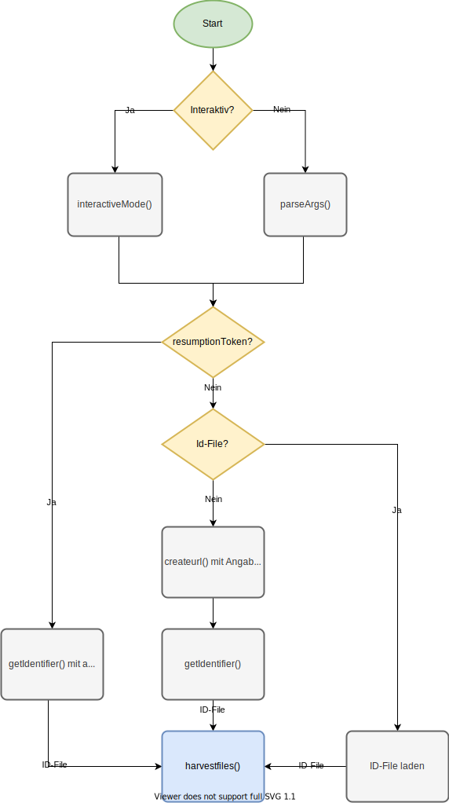

# Ometha

(*OaiMETadataHArvester*)

[[_TOC_]]

## Features

- Kann entweder mit Kommandozeilen-Parametern oder mit User-Input ausgeführt werden
  - Kommandozeilenmodus hat eine Funktion zur Automatisierung per YAML Konfigurationsdateien
- Kann gut für *nix/Windows gebundelt werden (funktioniert dann per Doppelklick unter Windows)

Da das Harvesting von METS/MODS Datenbeständen, anders als etwa Bestände in DublinCore, unseren Erfahrungen nach zu häufigen Ausfällen von OAI-PMH Schnittstellen führt und es im Rahmen der DDB eine besondere Anforderungen gibt, konnte nach Evaluierung kein vorhandener Harvester sinnvoll ohne erwartbare größere Anpassungen eingesetzt werden.

Die zentrale Anforderung für Workflow der Fachstelle Bibliothek ist, dass jeder OAI-Record in einer eigene Datei ist, mit eigenem OAI-Header. Das lässt sich theoretisch auch mit „normalem“ Harvesting erreichen (in dem man die XML Dateien nach dem Harvestingvorgang splittet), wir haben uns aber auch aus Gründen der Stabilität der Schnittstellen dafür entschieden, über das Verb `ListIdentifiers` zunächst alle relevanten OAI-IDs zu harvesten und dann per `GetRecord` die einzelnen Datensätze einen nach dem anderen anzuziehen. Das ist u. U. langsamer als ein direktest Harvesten per GetRecords, für unseren Usecase ist das aber nicht weiter relevant. Des weiteren kann das herunterladen der einzelnen Records nach dem sequentiellen Harvesten der Identifier parallel ausgeführt werden, was die Geschwindigkeit wiederrum erhöht.

Die zweite Anforderung an den Harvester ist der Spagat zwischen der Möglichkeit der Automatisierung und Benutzerfreundlichkeit. Daher umfasst Ometha drei Modi:

- einen „interaktiven“ Modus, der den Benutzer nach den Variablen fragt - nutzbar als Ometha.exe per Doppelklick unter Windows; keine Installation nötig
- Kommandozeilenmodus mit Parameter-Übergabe
- Kommandozeilenmodus per Konfigurationsdatei(en) inkl. vollautomatischem Update-Modus

Der Harvester geht darüber hinaus nicht überall von XML aus, sondern versteht den Return von der Schnittstelle z.T. als Plaintext und parst daher auch kein XML, sondern nutzt reguläre Ausdrücke zum herausfiltern von Fehlern u.a. [^1].

## Installation

Entweder vorkompiierte Ausführbare Datei herunterladen oder Download des Git-Repositorys und Installation von Python (mind. Version 3.7), dann Kommandozeile und `pip install -r requirements.txt`.

### Windows SmartScreen

Sollte Windows SmartScreen unter Windows 10 die Ausführung von Ometha.exe verhindern:


... klickt man auf den etwas unscheinbaren Link "Weitere Informationen" und dann erscheint ein kurzer Text und links neben dem Button "Nicht ausführen" der Button "Trotzdem ausführen". Letzterer startet das Programm.

## Der Ablauf von Ometha im Detail:

Egal mit welchem Modus Ometha gestartet wird, ein „normaler“ Harvesting Vorgang läuft immer so ab:

- Ometha holt sich zunächst per `ListIdentifiers` alle Identifier und schreibt diese zur Sicherheit in eine Datei
- Die ID-Liste wird dedupliziert und jeder einzelne Record wird per per `GetRecord` heruntergeladen
- Jeder Request wird 3 mal wiederholt, dann wird die Datei übersprungen (Per Timeout kann man die Zeit zwischen Anfragen variieren)
- Die Angabe des Datengebers ist nützlich, da so der Harvestvorgang in einen Unterordner geladen wird. Hier kann natürlich auch etwas anderes angegeben werden. Wenn keine Angabe erfolgt, wird ein Ordner per Timestamp erzeugt.
- Die Gesamte Ausführungszeit wird am Ende ausgegeben.
- Es wird ausführlich geloggt.

## Interaktiver Modus

Die Eingabe der Base-URL wird validiert, mehrere Sets werden kommagetrennt eingegeben: `Seteins,Setzwei`


#### Sonderfunktion: Informationen zu einer Schnittstelle abrufen

Die Sonderfunktion "Anzeige aller auf der Schnittstelle vorgandener Sets" parst ListSets und ListIdentifiers rekursiv, um eine Übersicht aller vorhandenen Sets und Metadata-Prefixe zu generieren:


## Aufruf über die Kommandozeile

**Information:** Es können sowohl die ausführbare Datei als auch das Python-Script ausgeführt werden, zunächst muss aber in der Kommandozeile per `cd` Befehl in den Ordner gewechselt werden, in dem die Datei liegt (es sei denn, die Ausführbare Datei ist im PATH, also unter Linux bspw. in `/usr/bin`). Dann beginnt der Aufruf entweder mit `Ometha.exe` (Windows) oder mit `python Ometha.py` (Python Aufruf) bzw. mit `Ometha` (Unix). In den folgenden Beispielen muss also der Beginn ggf. ausgetauscht werden.

Der Aufruf von Ometha kennt vier _"positional arguments"_, die die  Modi unterscheiden: `default`, `conf`, `auto` und `ids`. Je nach Modus werden dann weitere Argumente benötigt bzw. sind möglich.

### default Harvesting

- **Der "normale" (=default) Kommandozeilenmodus erwartet `default` als erstes Argument**
- Die Angabe der URL der Schnittstelle per `-b` ist dabei immer zwingend notwendig
- Ebenso die Angabe des Metadata-prefixes per `-m`.
- Alle anderen Parameter sind optional


Ein Kommandozeilenaufruf sieht dann bspw. so aus:

```
ometha default -b https://oai.schnittstelle.de -m metadataprefix -d ordnername -s set1 set2 -o /home/harvesting/
```

Optionale Parameter:

- `-s`: Angabe von Set(s): Mehrere Sets werden getrennt durch ein Leerzeichen eingegeben: `-s Seteins Setzwei`
- `-t`: Timeout zwischen den GetRecord Anfragen in Sekunden
- `-o`: Angabe des Ordners, in dem der beim Harvesting angelegte Datenpartner-Ordner erzeugt wird
- `-l`: Schalter (ohne weitere Angabe von Argumenten) für den "Lazy" Modus: Sequentielles statt paralleles Harvesten der Records (für instabile Schnittstellen, bei Timeout Problemen)
- `--resumptiontoken`: ResumptionToken, falls das Identifier Harvesting abgebrochen war und wieder aufgenommen werden soll ([keine Kurzform!](#errorhandling-abbruch-beim-harvesten-der-oai-identifier))
- `-f`: From-Date: ISO8601 Zeitangabe (YYYY-MM-DD), Harvesting von OAI Records ab diesem Zeitpunkt
- `-u`: Until-Date: ISO8601 Zeitangabe (YYYY-MM-DD), Harvesting von OAI Records bis zu diesem Zeitpunkt
- `-d`: Schalter (ohne weitere Angabe von Argumenten) um Debugging zu aktivieren (verboser Output)

### Harvesten mit Konfigurationsdateien

Ometha unterstützt Harvesting über Konfigurationsdateien. So können Harvestingvorgänge komplett automatisiert werden und auch per cronjob o. ä. aufgerufen werden. Beim Aufruf mit dem _positional_ Argument `conf` und dem Argument `-c` mit dem Pfad zu einer entsprechenden Konfigurationsdatei (`ometha conf -c /pfad/zur/konfigurationsdatei.yaml`) werden alle Parameter aus einer YAML Datei gelesen:

```
ometha.py conf -c saarland.yaml
```

Mit dem optionalen Parameter `-a` bzw. `--auto` wird der **Automatikmodus** für die Angaben des from- und until-Datums aktiviert: Dabei wird beim Start der until-Wert auf das aktuelle Datum gesetzt und somit der Zeitraum vom angegebenen from-Date bis zum aktuellen Zeitpunkt geharvestet, nach erfolgreichem Harvesting wird dann der from-Wert auf das aktuelle Datum gesetzt. Beim nächsten Harvesting Vorgang wird wieder zunächst das until-Datum aktualisiert, so dass immer der Zeitraum seit dem letzten Harvesting Vorgang eingestellt ist.

Bsp:

- Start mit `from = 2020-01-01` und `until = ''` am 10.02.2020
- `until` wird automatisch auf das aktuelle Datum (den 10.02.2020) gesetzt
- Harvesting also mit den Parametern vom 01.01.2020 bis zum 10.02.2020
- nach erfolgreichem Harvesting: YAML Datei wird geupdated, `from`-Date wird zum 10.02.2020, `until` bleibt auf 10.02.2020
- beim nächsten Vorgang am 31.03.2020: from steht jetzt auf 10.02.2020; until wird automatisch auf den 31.03.2020 gesetzt
- danach: `from` = 31.03.2020 usw.

Beispiel für eine Konfigurationsdatei:

```yaml
name: Saarland
baseurl: https://digital.sulb.uni-saarland.de/viewer/oai/
metadataPrefix: mets
datengeber: SULB
sets:
  - hk
fromdate: '2020-02-13'
untildate: null
timeout: 0
outputfolder: null
debug: false
lazy: null
```

Der Key `name` wird aktuell ignoriert; der String aus `datengeber` steuert den zu erzeugenden Ordner und die Dateinamen (in diesem Fall also `SULB/2020-06-04/SULB_1.xml`). In den Konfigurationsdateien sind **alle Keys obligatorisch** (das wird aber auch geprüft).

Leere Werte sind nicht zulässig bei `baseurl`, und `metadataPrefix`; sinnvoll ist die Angabe und `datengeber`. Der Key `debug` nimmt nur die Werte `true` und `false` annehmen, der Key `timeout` nur Zahlen. Alle anderen Keys erwarten Strings; from- und until-date können aber auch als Datum (ohne Anführungszeichen) eingegeben werden. Lazy erwartet `true` oder `null`

Mehrere Sets können hier auf zwei Weisen angegeben werden:

```yaml
sets:
  - Seteins
  - Setzwei
```

(Zwei Leerzeichen, Bindestrich, Leerzeichen, Setname: `  - setname`)

bzw.

```yaml
sets: ['Seteins', 'Setzwei']
```

Kommandozeilen Parameter für den `conf` Modus:

```
usage: Ometha conf [-h] --conf CONF [--auto] [--debug]

optional arguments:
  -h, --help            show this help message and exit
  --conf CONF, -c CONF  relativer oder absoluter Pfad zur YAML Konfigurationsdatei
  --auto, -a            Automatischer Modus zum Harvesten des Zeitraums vom from-date bis heute. Passt die Daten in der Konfigurationsdatei automatisch an.
  --debug               Gibt den Return der ListIdentifiers aus
```


### auto-Modus

Versucht, die Parameter aus einer kompletten OAI-URL auszulesen. Einziger Parameter ist `-u` für die URL:

```
Ometha auto -u https://digital.sulb.uni-saarland.de/viewer/oai/?verb=ListIdentifiers&metadataPrefix=mets&until=2021-01-01&set=saarlandica
```

### Harvesten per ID-Datei

Für den Fall, dass eine bereits mit Ometha erstellte ID Liste geharvestet werden soll, nutzt man den `ids` Modus:

```
usage: Ometha ids [-h] --idfile IDFILE [--lazy] [--datengeber DATENGEBER]
                  [--debug]

optional arguments:
  -h, --help            show this help message and exit
  --idfile IDFILE, -i IDFILE
                        Path to ID YAML File
  --lazy, -l            Disable Multithreading
  --datengeber DATENGEBER, -d DATENGEBER
                        Datengeber (Ordnername)
```

## Errorhandling: Abbruch beim Harvesten der OAI-Identifier

Falls beim Harvesten der OAI-IDs etwas schief geht, reicht es, sich den letzten anzeigten Resumption-Token zu notieren (bzw. in der Log-Datei zu schauen) und Ometha dann mit dem zusätzlichen Parameter `--resumptiontoken=resumptiontoken` auszuführen bzw. beim interaktiven Modus die Option `[R]` zu wählen:

```
ometha default -b https://oai.schnittstelle.de -m metadataprefix -d ordnername --resumptiontoken=nEk0tn0itpmuser
```

(Hier darauf achten, dass man immer `--resumptiontoken=` nutzt, da es durchaus ResumptionTokens gibt, die mit einem Bindestrich anfangen und somit im Kommandozeilenmodus als neuer Parameter verstanden würden, wenn man `--resumptiontoken -1dsada-2wdss` eingeben würde. Die verkürzte Option `-r` ist daher auch deaktiviert.)

<!-- ## Code-Flow

 -->


## Build/Installation

Kompilierung zu einer ausführbaren Datei mittels [PyInstaller](http://www.pyinstaller.org/):

```
pyinstaller -F Ometha.py
```

bzw. per Script:

So werden direkt mit [staticX](https://github.com/JonathonReinhart/staticx) externe Bibliotheken mit in die ausführbare Datei gepackt (sonst läuft etwa eine unter Linux Kernel > 5 erstellte Version nicht auf einem älteren Ubuntu Linux): `staticx dist/Linux/Ometha dist/Linux/Ometha`

```
python build_standalone_dist.py
```

### Erweiterte Installation (Linux)

Ausführbares Programm bspw. in `/usr/local/bin` oder `/usr/bin` kopieren (schauen dass der Ordner im PATH ist), damit Ometha von überall aufgerufen werden kann.